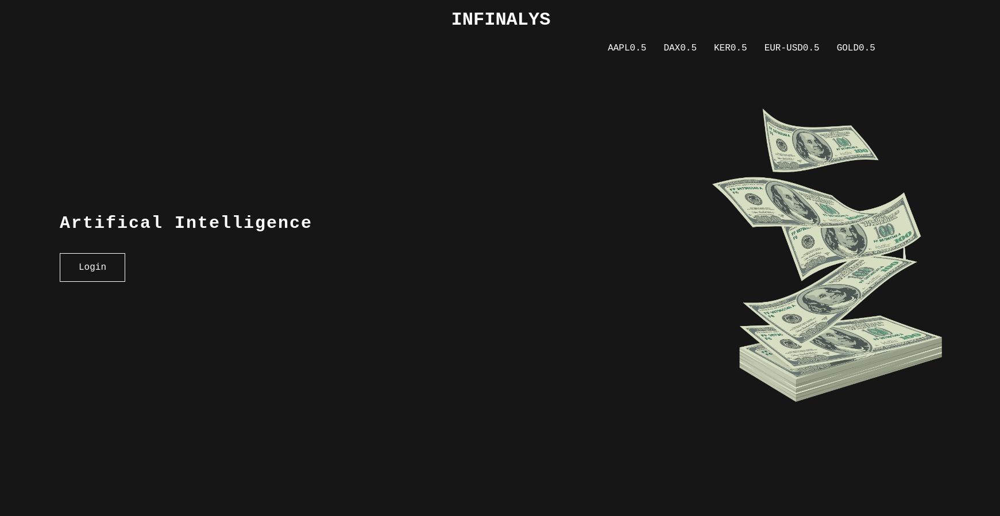

# Infinalys

infinalys is a **PoC** project that aims to provide a time series artificial intelligence for **stock predictions**.
The purpose of the project is also to provide a nice and clean **demo interface**.

# Stack overview

You can find below a summary of the project organization. For more details, please refer to the wikis !

## Backend

The backend is composed of three main components :

#### Predictor

**API**: ExpressJS, used to deliver stock prediction results.
**Script**: Python script, used to launch the training of the set stocks.

#### Jean-Pierre

**API**: ExpressJS, used to fetch and deliver RSS feeds (with search parameters) as JSON objects

#### Nicos

**API**: ExpressJS, used to connect all microservices

## Frontend

The front is made in React and JS. This stack is called Emma.

# Screenshots

Here is a small overview for a 4 days prediction :

## Authors

 - [Loïc Titren](https://github.com/loicttn)
 - [Robin Christol](https://github.com/Ltsrc)
